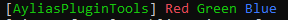

[Home](index.md)

##### Colored Chat

Using APT you can easily send colored console messages!

In your plugin's main class just simply import 

```java
import static com.aylias.minecraft.plugins.ayliasPluginTools.util.MessageTools.*;
```

And then use this line in `onEnable()`

```java
sendConsoleMessage("-c.r/Red -c.g/Green -c.b/Blue")
```

You should see a message like this in the console when you start your test server (With your plugin name in place of AyliasPluginTools):



You can also color chat messages, but that needs to be enabled so players can use it. Enable it by putting this line in `onEnable()`

```java
ATFeature.RAINBOW_CHAT.setEnabled(true);
```

You can also send rainbow chat messages to players, simple by doing this

```java
Player p = // Get your player however
p.sendMessage(colorizeMessage("-c.r/Hello -c.b/world-c.w/!"))
```

this would produce a result like this:


